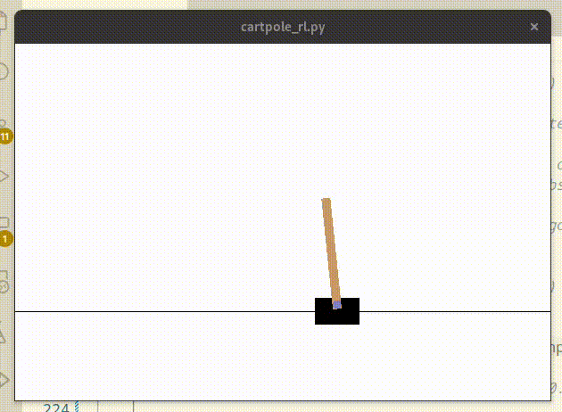

[](https://classroom.github.com/a/rmdLebzk)

# Exercise2a
Exercise 2a - Reinforcement Learning Foundamentals

A note for Linux users on Wayland:
Make sure the environmental variable `MPLBACKEND` to `GTK4Agg` and `QT_QPA_PLATFORM` to `wayland`

``` bash
    export MPLBACKEND=GTK4Agg
    export QT_QPA_PLATFORM=wayland
```

# Before you start, this is what you need to know

[Report](https://github.com/PolitoVandal/exercise2a-rl-fundamentals-enfff/blob/main/report.pdf)

I added the `--reward_type` option which allows the user to choose which reward function to use by choosing the associated input.

- `--reward_type=1` used to solve Task 3.1, point 1 
- `--reward_type=2` used to solve Task 3.1, point 2 
- `--reward_type=3` used to solve Task 3.1, point 3
- `--reward_type=4` Generic reward function that gives +1 under any circumstance

I've designed an **interactive graph** to better visualize how the *first two* reward function changes according to its parameters $x_0$, $\theta$ and $a$ can be found [by clicking here](https://www.desmos.com/calculator/dxuagx1kkl). Keep in mind that:

- $x_0$ the chosen point to reach, corresponding to the variable `args.central_point` (it can be set using the option `--central_point=...`)
- $x$ the first state variable corresponding to the kart current position
- $x_2$ the second state variable corresponding to the kart current angle

I’m aware the nomenclature isn’t coherent, I’m limited by the webapp

This what you should see:

(I have no clue why it is yellow and I have no time to fix it)


# LQR

## Task 1

Run the code with
``` bash
python3 cartpole_lqr.py --mode=control
```

## Task 2

Run the code with
``` bash
python3 cartpole_lqr.py --mode=multiple_R
```

# Reinforcement Learning
## Task 1.1

Run the code with 
``` bash
python cartpole_rl.py --reward_type=4 --random_policy --render_training
```

A new file CartPole-v0_params.ai will be generated, test it with
``` bash
python cartpole_rl.py --reward_type=4 -t CartPole-v0_params.ai --render_test
```

Now you can compare the results without the normal policy, 
``` bash
python cartpole_rl.py --reward_type=4 --random_policy --render_training
python cartpole_rl.py --reward_type=4 -t CartPole-v0_params.ai --render_test
```

## Task 1.2
In the main function, change the variable `env._max_episode_steps` to `200`, then generate the model with:

``` bash
python cartpole_rl.py --reward_type=4
```

Then, change it back to `500` and test the model with:
``` bash
python cartpole_rl.py --reward_type=4 -t CartPole-v0_params.ai
```

## Task 3.1
All rewards functions can be computed using the argument `--reward_type`, read more about it [here](https://github.com/PolitoVandal/exercise2a-rl-fundamentals-enfff#before-you-start-this-is-what-you-need-to-know).
### First Reward Function
### Second Reward Function
#### Either run my (tested!) models
Trained with $x_0 = 2$
``` bash
python cartpole_rl.py --reward_type=2 --central_point=2 --render_test -t params/CartPole-v0_params_t32_pos.ai 
```

or, train<ed with $x_0 = -2$
``` bash
python cartpole_rl.py --reward_type=2 --central_point=2 --render_test -t params/CartPole-v0_params_t32_pos.ai 
```
Before
if you'd like to use a model trained with $x_0=-2$, follow the steps above with `params/CartPole-v0_params_t32_neg.ai` (notice the `neg` at the end).

#### ..or generate your own
This example assumes $x_0 = 2$, but you're free to change it to any value  $\in (-2.4, 2.4)$

``` bash
python cartpole_rl.py --reward_type=2 --central_point=2
```
and 
``` bash
python cartpole_rl.py --reward_type=2 --central_point=2 --render_test -t CartPole-v0_params.ai 
```

### Third Reward Function
#### Either run my (almost working) model
``` bash
python cartpole_rl.py --reward_type=3 --render_test -t params/prova3/CartPole-v0_params_t33.ai 
```



#### ..or generate your own

``` bash
python cartpole_rl.py --reward_type=3 --train_episodes=4000
```

and 
``` bash
python cartpole_rl.py --reward_type=3 --render_test -t CartPole-v0_params.ai 
```